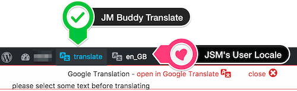
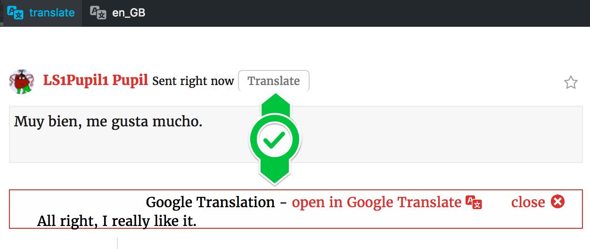
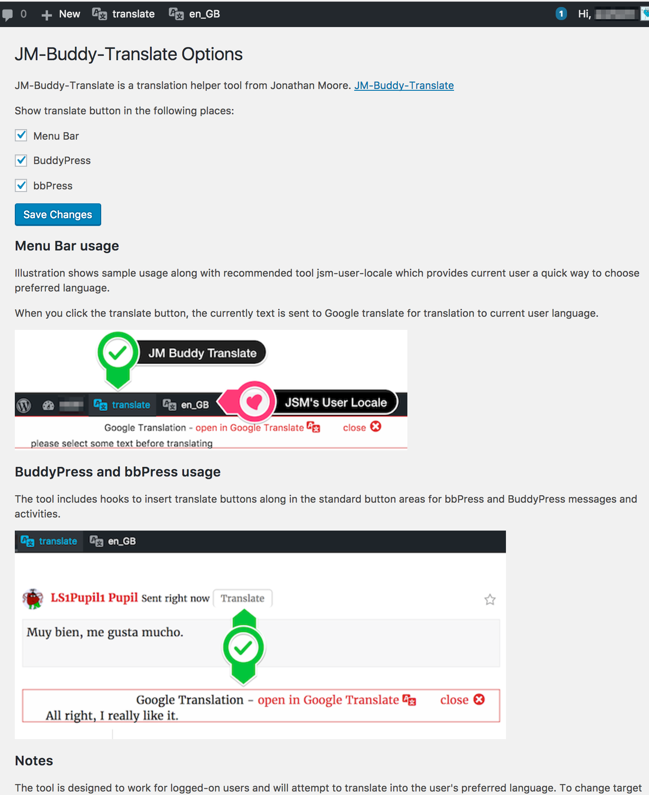

# JM Buddy Translate

## Description

Adds a Translate button to the WordPress admin bar to translate any selected text.
Adds Translate buttons to BuddyPress and bbPress messages.

## Installation

1. Upload the plugin files to the `/wp-content/plugins/plugin-name` directory, or install the plugin through the WordPress plugins screen directly.
1. Activate the plugin through the 'Plugins' screen in WordPress
1. Use the Settings->Plugin Name screen to configure the plugin
(By default the Translate buttons are turned on in all applicable contexts, in Settings you can individually turn off contexts and you can see a few hints on usage.)

## Screenshots

**Sample usage** along with recommended tool jsm-user-locale which provides current user a quick way to choose preferred language. When you click the translate button, the currently text is sent to Google translate for translation to current user language.
  

**BuddyPress and bbPress usage** The tool includes hooks to insert translate buttons along in the standard button areas for bbPress and BuddyPress messages and activities.
  

**Settings screen** - Here you can turn on or off the various integrations.
  

## Contribution

If you have a feature request, or if you have developed the feature already, please feel free to use the Issues and/or Pull Requests section.

Of course, you can also provide me with [translations](https://translate.wordpress.org/projects/wp-plugins/jm-buddy-translate) if you would like to use the plugin in another not yet included language.

## License

Copyright (c) 2017 Jonathan Moore

This code is licensed under the [GPLv3 License](LICENSE).

